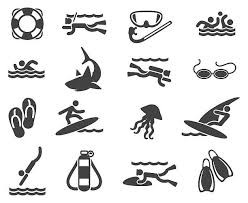

```{r setup, echo=FALSE}
options(htmltools.dir.version = FALSE)
knitr::opts_chunk$set(
  fig.width=8, fig.height=3.5, fig.retina=3,
  out.width = "100%",
  cache = FALSE,
  echo = TRUE,
  message = FALSE, 
  warning = FALSE,
  hiline = TRUE
)
```

```{r xaringan-themer, include=FALSE, warning=FALSE}
library(xaringanthemer)
style_mono_accent (base_color = "#43418A",
 header_font_google = google_font("Josefin Sans"),
  text_font_google   = google_font("Montserrat", "300", "300i"),
  code_font_google   = google_font("Fira Mono")
)
```

```{r, include=FALSE}
library(countdown) 
```


```{r, include=FALSE}
bb <-"Bertrand Bhikarry"
```

```{r, include=FALSE}

et <-"Environment Tobago"
```
```{r, include=FALSE}
ngo <-"Non-profit organisation"
```
```{r, include=FALSE}
ngos <-"Non-profit organisations"
```

```{r, include=FALSE}
canari <-"Caribbean Natural Resources Institute"
```

```{r, include=FALSE}
thata <-"Tobago Hotel and Tourism Association"
```

```{r xaringan-logo, echo=FALSE}
xaringanExtra::use_logo(
  image_url = "https://drive.google.com/uc?export=view&id=11GveNpJ7VdDl4t1pUGszDuM10P-KCMaB"
)
```


```{r, echo=FALSE}
xaringanExtra::use_webcam(width = 300, height = 225)
```
```{r xaringan-panelset, echo=FALSE}
xaringanExtra::use_panelset()
```

```{r xaringanExtra, echo=FALSE}
xaringanExtra::use_xaringan_extra(c("tile_view", "animate_css", "tachyons"))
```

## A moment for virtual housekeeping

**Press the 'H' key**. Press it again to get out.

**Press 'F'**. Press it again to Undo FullScreen

**Press 'O'**. Repeat to Undo Overview 

Navigate with ARROW KEYS.  Try  <strong>' &#10093; '</strong>

### Tip
 Press the 'F" key and let the app do the work.

???
Slide 2
---
name: welcome-slide

## Welcome

 We are here to discuss the Tobago implementation of the IDDRI [Blue Economy](#blu) Project


???
Slide 3
---
name: dtf
##  Tourism and digitisation (Hand in glove)

<!-- Quantify the scope of the problem and connect it to my audience -->


  Local Blue Economy is lacking a coherent/cohesive modern tech framework.   
Tourism can provide data gathering and information dissemination capacity well into the medium term. 


```{r dtl, echo=FALSE, fig.height=4.5, fig.width=7.5}

DiagrammeR::grViz(" digraph G{ layout=dot; 
    oneblock=true; rankdir=LR;
node 
[shape=plaintext,styled=true, fontname=Helvetica]

A[label='ACHIEVE SDGs \n SUSTAINS TOURISM '];
B[label=' DIGITAL TRANSFORMATION'];
C[label='  Teaches  '];
D[label=' Motivates'];
E[label=' Enables partnerships '];
F[label=' Aligns global thinking '];
G[label=' Helps business'];

edge 
[color=LightBlue, arrowhead=double]
{B->C->D->E->F->G->B}->A;

}")

```


>**Key objectives**: Digital Transformation, Resilience, Competitiveness, Socio-environmental sustainability

???
If I came here from 'TOC Expanded /Needs' and want to go back: 9+ENTER

---

## Aligning Tobago tourism with global BLUE

.left-column[ **Blue recreation**  




]

.right-column[

### Consider...

Negative effects resulting from tourism can be observed on different levels namely; 

  * the island's economic well-being, 
  * the population's social well-being, 
  * its cultural well-being and
  * its environmental well-being.

Tourism is the sector most affected by COVID. Tobago's recovery **will** see accelerated tourism. 
  * Sustainable growth requires tech to walk the talk   
]

---

## Protect Blue: Pilot within pilot

.left-column[
*Pterois volitans* poses a major and direct threat to ecologies, ecosystems and economies.  


It follows that actions to control lionfish is priority for the tourism sector.
]

.right-column[


#### Questions: 

  1. What is the likelihood of stemming the lionfish population curve before the habitats are destroyed? 
  1. What marine recreational activities might enable lionfish tracking, hunting (catching) and serving?
  1. If the probable outcome is bad in the near term why not bring in grouper from the Pacific?  
  1. Gender balance in the proposed fishery?
  
>&#9798; Bring Grouper from the Maldives to Tobago (Joint activity) or at least do a desktop research on successful specie introductions 

&#9888; *Align our pilot project actions to IDDRI's sought outcome by tackling this threat to tourism and marine ecosystems*.

]

???
Hashtag #ProtectBlue

Achieving Gender balance in the proposed fishery will require program funds in the early stages to access markets - allowing the business will be run by women. Further, technological assistance may be required in-project. 


---


## Lionfishery. Problem becomes Opportunity &#8623;

```{r opportune, echo=FALSE, fig.height=6, fig.width=8}
DiagrammeR::grViz("digraph
                  {graph [rankdir = LR]
                  
                  # primary nodes
                  node [shape = plaintext, style = filled, fillcolor = WhiteSmoke, fontname = Helvetica, fontsize = 22, color=Blue]
                  
A [label = 'Reduced strain on the coastal ecological balance '];

# Row 2

B [label = 'Improved take'];
       
C [label = 'Improved lionfish consumption in \n homes hotels eateries..'];

D [label = 'Greater public understanding of lionfish threat \n to marine ecology, socioenvironment, GDP'];

# Row 3 Col 1

1 [label = 'Cash the Catch'];
 
2 [label = 'Lionfish weekends (Hunt campaigns)'];

3 [label = 'Introduce-Mentor-Monitor pot fishing'];

# Row 3 Col 2

4 [label ='Sell to restaurants, homes, eateries'];
5 [label ='Introduce to nursing homes & schools feeding as menu item'];
6 [label ='Low cost 2kg REUSABLE icepacks', style=filled, fillcolor=White];

# Row 3 col 3

7 [label ='Hunts - videoed'];
8 [label = 'Layday Lionfish limes. (Cook-offs)'];
9 [label = 'Recycling drive \n for pot materials'];
10 [label ='Import Pacific goliath groupers as a predator'];
11 [label ='No Hunt grouper campaign'];
                  
                  
# edges
edge [color=LightBlue]
A ->{B C D};
B ->{1 2 3};
C ->{4 5 6};
D ->{7 8 9 10 11};
                  
                  }                  
                  ")

```


---


## Lionfish fishery (a Tobago pilot)

||Description|Indicators|MoV|Risks and Assumptions|
|:---|:---|:---|:---|:---|
|Goal|1. Establish lionfish as a responsible meal for breakfast, lunch or dinner in home, villa kitchens, eateries and restaurants||||
|Outcomes|1. Reduce and destabilise *Pterois volitans* in local waters||||
|Outputs|1. Lionfish on select grocery shelves||||  
||2. Lionfish on the School Feeding Programme menu ||||
|Activities|1. Diver derby||||
||2. Prep workshop in Hotel & Tourism School||||
||3. Prep workshop at Schools Nutrition Center ||||
||4. First Lionfish Cook-Off||||
||5. Fishpot construction, deployment and retrieval workshop||||

---
## So....

.panelset.sideways[

.panel[.panel-name[Its that time]


.....  We have looked at a lionfish initiative using the Logical Framework. How about we test it using the Theory Of Change approach? 

<!-- TOC coming up in .panel-set[The TOC Approach] -->


<iframe width="560" height="315" src="https://www.youtube.com/embed/380CE6sTLzk?controls=0&amp;start=26" title="YouTube video player" frameborder="0" allow="accelerometer; autoplay; clipboard-write; encrypted-media; gyroscope; picture-in-picture; web-share" allowfullscreen></iframe>

]


.panel[.panel-name[Theory of Change Approach]


```{r toc, echo=FALSE}

DiagrammeR::grViz(" digraph { rankdir = LR; layout = dot; oneblock = true;

#nodes

  node [shape = box, fontname = Helvetica]

A [shape = plaintext, label = 'Each step validated with \n evidence and stakeholder consultation'];


  subgraph{ rank = same;
    node [shape= box, style = filled]

B [label = 'Step 1 \n Focus', fillcolor = Yellow]; 
C [label = 'Step 2 \n  Identify what is needed for change ', fillcolor = Yellow];
}

  subgraph { rank = same; 
    node [shape= box, style = filled]
D [label = 'Step 3 \n Reflect assumptions and risks', fillcolor = Yellow]; 
E [label = 'Step 4 \n Identify partners and actors', fillcolor = Yellow];
}

# edge
    edge [arrowhead=vee, color = LightBlue]

B -> C-> D -> E;

}

")
```
] ]

???
Explain the Diff between LF and TOC.
---
## TOC. Expanded


.panelset.sideways[

.panel[.panel-name[Step 1. Focus]

  *Focus is on high level change*.   
  
  A combo of two parts. Improved bookings And an SDG aware community (more tourists and a visible drive to predate lionfish in coastal waters)  
 ]   
    
.panel[.panel-name[Step 2. Needs]   

  >*What is needed for these things to happen*?  
  
  1. [**A digital hub**](#dtf) with relevant content for/and by, local community, businesses, homes and the respective travel markets. 
  
  1. A sustained **public awareness campaign** to kill/sell/buy/eat lionfish, seeking to ease grouper and snapper fishing.....
  
  1. **A business venture** dealing in 'responsibly' caught (and grown) foods for home, hospitality, health and school feeding sectors. To include the away market...
  

    ]

.panel[.panel-name[Step 3. Assumptions]

 >**Assumptions**: For portal & lionfishery      

  1. Third party bookings (f.e Expedia) is a credible model
  1. Online bookings (room and tour) will be positively impacted by a web application which;  
    - emphasises responsible use of resources to tourism stakeholders
    - sensitises the public to the threat that is *Pterois volitans*  
  1. Project impacts national policy and thinking; 
    - by placing natural lionfish predators (grouper and snapper) on a 'protected' list   
    - by selling 'responsibly' fished (lionfish and other species) via Internet  
  1. A Common booking module will
    - increase visibility of roomstock
    - allow (some) standardisation to global benchmarks
]

.panel[.panel-name[Step 3. . ... Risks]

>**Risks** - to both portal & lionfishery


  1. Can the cost of running the portal be covered solely by fees from participant businesses? 
  
  1. Will lionfish find fishtraps attractive?
  (so the processors can survive)
  
  1. Will fisherfolk will buy into the 'responsible' approach of leaving  natural lionfish predators to thrive?

]


.panel[.panel-name[Step 4 Partners]

*Taking into account Assumptions and Risks, who are the partners actors most relevant to achieving each result*? 

  * Get In Touch Co
  * Environment Tobago
  * THTA

] ]

---
## Justifying Digital Transformation

.panelset.sideways[

.panel[.panel-name[Financial perspective]
## &dollar;   &nbsp; &euro; &nbsp; &pound;
  <!-- 1. **Financial perspective** -->
  * Increased business
  * Reduced input costs 
  * Less labour costs
]    
    
.panel[.panel-name[ Business process perspective] 

# &#9730;
  * More online bookings
  * Simplified rostering
  * Staff managed online
  * Improved customer loyalty schemes
  * Easier feedback (all segments)
  

]    
  
.panel[.panel-name[Learning and growth perspective]

# &#9729;  

  * Improved customer service
  * Greater possibilities to speak/teach responsible Blue
  * Staff training medium (benefits)
]
.panel[.panel-name[Customer perspective]
# &#9787;

  * Excellent customer service
  * Friendly staff
  * Customer loyalty scheme
  * Premium choice options
  

]
]  

???
Balanced scorecard system

---
## Portal logframe

||Description|Indicators|MoV|Risks and Assumptions|
|:---|:---|:---|:---|:---|
|GOAL|1. **Attract** Blue recreation clientele||||
||2. **Improve** responsible seafood selections ||||
|OUTCOMES|1. **Online campaign** to reduce load on other (popular) marine species ||||
||2. **Enable** fisher and restaurant **feedback** to obtain a feel for lionfish invasion level and demand for filets||||
|OUTPUTS|1. **Online/On-ground multipart lionfish reduction campaign**||||
||2. Digital **portal enabling Onestop general knowledgebase as well as bookings** for rooms and tours ||||
|ACTIVITIES|1. **Creation of booking system** to improve 'blue oriented' customer base ||||  
||2. Lionfish food prep workshops, Responsible eating **Radio/TV/YouTube** show and other related digital strategies as advised||||
||3. **Responsible catch restaurants** listing (*menus*?)||||


---
## Partnership potential (Just within THTA)

.panelset.sideways[

.panel[.panel-name[Allied Sector]


```{r alliedsector, echo=FALSE, paged.print=TRUE}

library(readr)
  allies <- read_csv("sheets/alliedSheet1.csv", skip = 1, 
                 show_col_types = TRUE,
col_names=c("BUSINESS NAME","","","REPRESENTATIVE","","EMAIL ADDRESS", "","","","UNIQUE ID")

)
# create variable with the desired data
   alx = allies[c(1,4)]


knitr::kable(head(alx, format = 'html', n = 12))


```  

]

.panel[.panel-name[Restaurants]


```{r restaurant, echo=FALSE, paged.print=TRUE, show_col_types=TRUE}
library(readr)
  restaurants <- read_csv("sheets/restaurantsSheet1.csv", skip = 1,
col_names=c("ESTABLISHMENT","","","REPRESENTATIVE","","EMAIL ADDRESS", "","","","UNIQUE ID") )
# create variable with the desired data
  res = restaurants[c(1,4)]

#print(res)
  
knitr::kable(head(res, format = 'html', n = 12))  
       
```
]

.panel[.panel-name[Villas and Cottages]

```{r villascottages, echo=FALSE, paged.print=TRUE}

library(readr)
vilcot <- read_csv("sheets/villasCottagesSheet1.csv",  skip= 10,
                  show_col_types = TRUE ,
                   col_names=c("PROPERTY NAME","","","REPRESENTATIVE","","EMAIL ADDRESS","","","","UNIQUE ID") )
vc = vilcot[c(1,4)]

# print(vc, n=10)  
knitr::kable(head(vc, format = 'html', n = 10))

```

]

.panel[.panel-name[Large Hotels]


```{r bighotels, echo=FALSE, paged.print=TRUE}
library(readr)
  bigAccs <- read_csv("sheets/largeSheet1.csv", skip = 1,
                      
col_names=c("PROPERTY NAME","","","REPRESENTATIVE","","EMAIL ADDRESS", "","","","UNIQUE ID") )
# create variable with the desired data
  bac = bigAccs[c(1,4)]
  
# print(bac)  
knitr::kable(head(bac, format = 'html', n = 12))  
  
```  

]


.panel[.panel-name[Smaller Hotels]

```{r echo=FALSE, paged.print=FALSE}

library(readr)

smallaccs <- read_csv("sheets/smallAcc.csv", skip=1,
                      show_col_types = TRUE,
 col_names=c("PROPERTY NAME","REPRESENTATIVE","EMAIL ADDRESS" ,"UNIQUE ID"))

smx = smallaccs[c(1,2)]
    
#print(smx)   
knitr::kable(head(smx, format = 'html', n = 12))

```
]


]

---
layout: false

## Project Leaders

.pull-left[

 
 
]

.pull-right[


]
---

## Need to know

.left-column[ 
#### IDDRI Tobago Overview

Submission due-date

Country

Sector

Value (*Total*)

Counterpart financing

Post registration briefing (*webinar*)
]

.right-column[

RG-T3660

March 30th, 2022

Regional  

Sustainable tourism  

US$1.5M

$0

[my Link to briefing](https://www.google.com/url?q=https://iadb-org.zoom.us/w/92586696123?tk%3DwRDKF3AmrlWlNGVhVWiFyXj1RoSgeU1nWPomUfU-dYI.DQMAAAAVjpjduxY0RFQxVHlnOFIwYUItQ3dzSG0xaktBAAAAAAAAAAAAAAAAAAAAAAAAAAAAAA%26uuid%3DWN_vjtcQvGCSKid4qCQkyCdtQ&sa=D&source=calendar&ust=1644518439020737&usg=AOvVaw0SiBcXCN-QAvnSVBkn1mxs)
]
<!--- briefing link best obtained by registering--->
.footnote[This Technical Cooperation (TC) aims to generate methodological and operational instruments that contribute to the digitization of the LAC tourism sector to reactivate tourism activity under the new context posed by the COVID19 pandemic, as well as to respond to sectoral challenges of structure.]
---

## Of importance

What do the beneficiary destinations get?

Each selected destination will obtain:

- A personalized diagnosis of its level of technological readiness, based on its main challenges (*prioritized by the destinations themselves*); 

- A detailed action and pre-investment plan (*agreed between the public and private sector*) to accelerate technological assimilation at the destination. 

.footnote[Ten (10) destinations will be selected from; Trinidad and Tobago, Argentina, Barbados, Bahamas, Belize, Brazil, Bolivia, Nicaragua, Mexico, Jamaica, Honduras, Haiti, Guyana, Guatemala, El Salvador, Ecuador, Costa Rica, Columbia and Chile.]

---
## Selection criteria

Applicant (beneficiary destinations) must have;

1. A tourism org (*like TTAL, THATA*)

1. Duly signed letters of interest from key stakeholder groups

1. A dedicated team with active private-public sector reps.

1. a diagnosis of the destination (*ESG considerations*)

1. a tourism plan *in force*

---

## Selection process

Applications will be evaluated and scored (*closest to 60 pts*)

.panelset.sideways[
.panel[.panel-name[Scope of the diagnosis. 25 points]

]
.panel[.panel-name[Team strength. 15 points]

  
]

.panel[.panel-name[Public-Private letter of interest. 20 pts]

]
]


---


## A quick check before diving in
.pull-left[
Does this project fits Tobago's


1. <input type="checkbox" checked> developmental outlook</input>

1. <input type= "checkbox" unchecked> benefits investors</input>,

1. <input type= "checkbox" unchecked> local stakeholders</input> and 

1. <input type= "checkbox" unchecked> visitors</input>
]
.pull-right[

Probably a good idea to think this thru
]

---
class: center, middle

## Up for discussion

<dl>
<dt>A contract has to be signed</dt>
<dd><strong>Who? When?</strong>?</dd>
</dl>


---
name: blu

## Blue Economy 


>“An economic activity that directly or indirectly uses ocean or river resources as an input, and contributes or does not negatively affect the health and sustainability of ocean and river ecosystems. It emphasises conservation and sustainable management based on the idea that healthy ocean ecosystems are more productive and therefore fundamental to sustainable, ocean-based economies. Further, sustainable management implies that economic activity is in balance with the long-term capacity of ocean ecosystems to support such activity..”

 (*Compete Caribbean 2021*)  [Back](#welcome-slide)


---
## Table

```{r}
knitr::kable(head(alx), format = 'html')
```
---

class: inverse, right, bottom

.can-edit[

# Thank you


]


