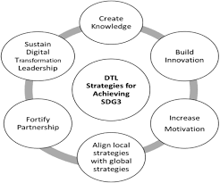

```{r setup, echo=FALSE}
options(htmltools.dir.version = FALSE)
knitr::opts_chunk$set(
  fig.width=8, fig.height=3.5, fig.retina=3,
  out.width = "100%",
  cache = FALSE,
  echo = TRUE,
  message = FALSE, 
  warning = FALSE,
  hiline = TRUE
)
```

```{r xaringan-themer, include=FALSE, warning=FALSE}
library(xaringanthemer)
style_mono_accent (base_color = "#43418A",
 header_font_google = google_font("Josefin Sans"),
  text_font_google   = google_font("Montserrat", "300", "300i"),
  code_font_google   = google_font("Fira Mono")
)
```

```{r, include=FALSE}
library(countdown) 
```


```{r, include=FALSE}
bb <-"Bertrand Bhikarry"
```

```{r, include=FALSE}
et <-"Environment Tobago"
```
```{r, include=FALSE}
ngo <-"Non-profit organisation"
```
```{r, include=FALSE}
ngos <-"Non-profit organisations"
```

```{r, include=FALSE}
canari <-"Caribbean Natural Resources Institute"
```

```{r, include=FALSE}
thata <-"Tobago Hotel and Tourism Association"
```

```{r xaringan-logo, echo=FALSE}
xaringanExtra::use_logo(
  image_url = "https://drive.google.com/uc?export=view&id=11GveNpJ7VdDl4t1pUGszDuM10P-KCMaB"
)
```


```{r, echo=FALSE}
xaringanExtra::use_webcam(width = 300, height = 225)
```
```{r xaringan-panelset, echo=FALSE}
xaringanExtra::use_panelset()
```

```{r xaringanExtra, echo=FALSE}
xaringanExtra::use_xaringan_extra(c("tile_view", "animate_css", "tachyons"))
```

## Framing IDDRI Tobago pilot

<!-- Quantify the scope of the problem and connect it to my audience -->

>**Keywords**: Resilience, Competitiveness, Socio-environmental sustainability, Blue oriented tourism.

#### Local 'Blue' needs to be placed into a modern tech framework with data gathering and information dissemination at its core.



Objectives: To **service the Keywords** and **embed ESG partnerships**. 

---

## Pushing tourism into the Blue (responsibly)

.left-column[ Recreational  &nbsp; **B.E.**  


Fishery type activities are missing. One oh  momento.
]

.right-column[
Tourism is the sector most affected by COVID. Country recovery **will** see accelerated tourism. Its sustainable growth requires tech.
]

---

## Protecting our Blue 

.left-column[
*Pterois volitans* poses a major and direct threat to ecologies, ecosystems and economies.  


It follows that actions to control lionfish (*population*) become priority for the tourism sector.
]

.right-column[*Note to self*:
Balance pilot project actions by tackling this threat to Blue tourism and local marine ecological systems.

*Hint*:  Several marine recreational activities enable lionfish tracking, hunting (catching) and serving.

*Questions*: 

  1. What is the likelihood of stemming the lionfish population curve before the habitats are destroyed? 
  1. If the probable outcome is bad why not bring in grouper (fish) from the Pacific?
  
>**Possible project action**: Bring Grouper from the Maldives to Tobago (Joint activity) or ar least do a desktop research on successful specie introductions

]
---


## Local lionfish fishery. A pilot 

||Description|Indicators|MoV|Risks and Assumptions|
|:---|:---|:---|:---|:---|
|Goal|1. Establish lionfish as a responsible meal for breakfast, lunch or dinner in home, villa kitchens, eateries and restaurants||||
|Outcomes|1. Reduce and destabilise *Pterois volitans* in local waters||||
|Outputs|1. Lionfish on a grocery shelf||||  
||2. Lionfish as a school feeding programme menu item ||||
|Activities|1. Diver derby||||
||2. Prep workshop in Hotel & Tourism School||||
||3. Prep workshop at Schools Nutrition Center ||||
||4. Responsible fish cook-off||||
||5. Fish pot construction workshop||||

---
## Local lionfishery. As opportunity
```{r echo=FALSE, fig.height=5, fig.width=8}
DiagrammeR::grViz("digraph
                  {graph [rankdir = LR]
                  
                  # primary nodes
                  node [shape = box, style = filled,fillcolor = Beige, fontname = Helvetica, fontsize = 22, color=LightGray]
                  
A [label = 'Reduced strain on the coastal ecological balance '];

# Row 2

B [label = 'Improved take'];
       
C [label = 'Improved lionfish consumption in \n homes hotels eateries..'];

D [label = 'Greater public understanding of lionfish threat \n to marine ecology, socioenvironment, GDP'];

# Row 3 Col 1

1 [label = 'Cash the Catch'];
 
2 [label = 'Lionfish weekends (Hunt campaigns)'];

3 [label = 'Introduce Mentor Monitor pot fishing'];

# Row 3 Col 2

4 [label ='Sell to restaurants, homes, eateries'];
5 [label ='Introduce to nursing homes & schools feeding as menu item'];
6 [label ='Low cost 2kg reusable icepacks', style=filled, color=SeaGreen, fillcolor=AquaMarine];

# Row 3 col 3

7 [label ='Hunts - videoed'];
8 [label = 'Layday Lionfish limes. (Cook-offs)'];
9 [label = 'Recycling drive \n for pot materials'];
10 [label ='Import Pacific goliath groupers as a predator'];
11 [label ='No Hunt grouper campaign'];
                  
                  
# edges
edge [color=LightGray]
A ->{B C D};
B ->{1 2 3};
C ->{4 5 6};
D ->{7 8 9 10 11};
                  
                  }                  
                  ")


```

---
## Rollin in the deep

.panelset.sideways[
.panel[.panel-name[The Approach]

```{r echo=FALSE}

DiagrammeR::grViz("digraph {

graph[rankdir = TB]

#nodes
node[shape = rectangle, style = filled, fontname = Helvetica, fixedsize = false]

A [shape = folder, fillcolor = Beige, label = 'Validate with evidence \n and stakeholder consultation']; 


subgraph
{rank = same; 
node[shape = box, style = filled, fixedsize = false]

B [label = 'Step 1 \n Focus', fillcolor = orange]; 
C [label = 'Step 2 \n  Identify what is needed for change ', fillcolor = yellow];
}

subgraph{rank = same; 
D [label = 'Step 3 \n Reflect assumptions and risks', fillcolor = LightGoldenrodYellow]; E [label = 'Step 4 \n Identify partners and actors', fillcolor = LightYellow];}

# edge
edge [arrowhead=vee, color = blue]

B -> C-> D -> E

}
")

```
]

.panel[.panel-name[Briefly explained here]

  Well we can but perhaps another time. (A lot of text goes here would video recording suffice? )
]

]

---


## Get In Touch. The web portal 

**Theory of change** (4 Steps)

<!-- Theory of Change -->

<!-- https://www.cvereferenceguide.org/index.php/en/design/creating-theory-change -->

```{r echo=FALSE}

DiagrammeR::grViz("digraph {
graph [rankdir = RL;]

#nodes

node [shape=plaintext, style= filled, fontname = Helvetica]

A [shape = plaintext, label = 'All steps validated \n with evidence and stakeholder consultation']; 

subgraph{ rank= same;     
B [label = 'Step 1 \n Address current Blue Tourism niche development challenges leading with a comprehensive digital strategy.\n Contribute to ecological resiliency in the near to  medium term by developing an island-based lionfish fishery.', fillcolor = Bisque, shape = box]; 

C [label = 'Step 2 \n  Needed for change: \n Timely and useful communication  \n A Common booking system to close  tours and room enquiries efficiently. \n A Blue product showcase and knowledgebase. \n Usage statistics.', fillcolor = Linen];
}

subgraph{fixedsize = false;

D [label = 'Step 3 \n Reflect assumptions and risks e.g \n Local providers slow to adopt E-practises. \n Trust in advertising a minus factor. \n Tobago coastal zones including its reefs \n i.e a substantial part of its tourism product \n has low resiliency to changing climate.', fillcolor = LightGoldenrodYellow]; 

E [label = 'Step 4 \n Build a symbiotic network for bookings \n by forging business partnerships with accommodation providers \n and tour guides.\n Build another similar network with the food value chain  to include \n fishers, restaurateurs, schools feeding nutrition center, \n  hotel school, household cooks, caterers etc. ', fillcolor = LightYellow];
}

# edge
edge [arrowhead=vee, color = blue]

B -> C-> D -> E

E -> A [style = invis]

}
")

```
---
## Web portal rationalised

<!-- frame the panel -->
.panelset.sideways.right[


.panel[.panel-name[The Problem]
One
]
.panel[.panel-name[Our Solution]
Two
]

.panel[.panel-name[The Team]
Three

]

.panel[.panel-name[Milestones]
Four

]

.panel[.panel-name[Team]
Three

]

<!-- panel frame ends -->
]


---
# Revenue (Ability to Sustain)

.left-column[### Model]

.right-column[### Consumer
### Supplier
### Quality control    
]


---
## Portal logframe

||Description|Indicators|MoV|Risks and Assumptions|
|:---|:---|:---|:---|:---|
|GOAL|1. **Attract** Blue recreation clientele||||
||2. **Improve** responsible seafood selections ||||
|OUTCOMES|1. **Online campaign** to reduce load on other (popular) marine species ||||
||2. **Enable** fisher and restaurant **feedback** to obtain a feel for lionfish invasion level and demand for filets||||
|OUTPUTS|1. **Online/On-ground multipart lionfish reduction campaign**||||
||2. Digital **portal enabling Onestop general knowledgebase as well as bookings** for rooms and tours ||||
|ACTIVITIES|1. **Creation of booking system** to improve 'blue oriented' customer base ||||  
||2. Lionfish food prep workshops, Responsible eating **Radio/TV/YouTube** show and other related digital strategies as advised||||
||3. **Responsible catch restaurants** listing (*menus*?)||||


---
## Opportunity, Solutions for a local lionfishery

```{r echo=FALSE, fig.height=5, fig.width=7.5}
DiagrammeR::grViz("digraph
                  {graph [rankdir = RL]
                  
                  # primary nodes
                  node [shape = box, fillcolor = WhiteSmoke, fontname = Helvetica, fontsize = 22, color=LightGray]
                  
A [label = 'Reduced strain on the coastal ecological balance '];

# Row 2

B [label = 'Improved take by fishers'];
       
C [label = 'Improved level of lionfish consumption in homes hotels  etc'];

D [label = 'Improved public understanding of lionfish threat to marine ecology'];

# Row 3 Col 1

1 [label = 'Reward catchers with cash'];
 
2 [label = 'Lionfish meme hunt campaigns'];

3 [label = 'Introduce and Mentor pot fishing'];

# Row 3 Col 2

4 [label ='Sell to restaurants, homes, eateries'];
5 [label ='Introduce filets to nursing homes, \n Schools feeding as menu item'];
6 [label ='Provide low cost 2kg re-usable icepacks to lionfishers '];

# Row 3 col 3

7 [label ='Spearfishing derbies - videoed'];
8 [label = 'Lionfish cook-offs'];
9 [label = 'Recycling drive \n for re-bar and fishnet chunks for pot construction'];
                  
                  
# edges
edge [color=LightGray]
A ->{B C D};
B ->{1 2 3};
C ->{4 5 6};
D ->{7 8 9};
                  
                  }                  
                  ")


```

---
## Plan for slideshow

Separate the mini-projects Lionfish and Get In Touch web like;

**Logical Frame for Lionfishery project**

Useful and well understood for project proposing, implementation and reporting


**Theory of Change for Website.**

TOC helps to diagrammatically keep the bigger picture in sight wcwn as the discussions delve down to resource acquisition, usage and reporting.


---
layout: false

## Project Leader

<center>

</center>

---

## Need to know

.left-column[ 
#### IDDRI Tobago Overview

Submission due-date

Country

Sector

Value (*Total*)

Counterpart financing

Post registration briefing (*webinar*)
]

.right-column[

RG-T3660

March 30th, 2022

Regional  

Sustainable tourism  

US$1.5M

$0

[my Link to briefing](https://www.google.com/url?q=https://iadb-org.zoom.us/w/92586696123?tk%3DwRDKF3AmrlWlNGVhVWiFyXj1RoSgeU1nWPomUfU-dYI.DQMAAAAVjpjduxY0RFQxVHlnOFIwYUItQ3dzSG0xaktBAAAAAAAAAAAAAAAAAAAAAAAAAAAAAA%26uuid%3DWN_vjtcQvGCSKid4qCQkyCdtQ&sa=D&source=calendar&ust=1644518439020737&usg=AOvVaw0SiBcXCN-QAvnSVBkn1mxs)
]
<!--- briefing link best obtained by registering--->
.footnote[This Technical Cooperation (TC) aims to generate methodological and operational instruments that contribute to the digitization of the LAC tourism sector to reactivate tourism activity under the new context posed by the COVID19 pandemic, as well as to respond to sectoral challenges of structure.]
---

## Of importance

What do the beneficiary destinations get?

Each selected destination will obtain:

- A personalized diagnosis of its level of technological readiness, based on its main challenges (*prioritized by the destinations themselves*); 

- A detailed action and pre-investment plan (*agreed between the public and private sector*) to accelerate technological assimilation at the destination. 

.footnote[Ten (10) destinations will be selected from; Trinidad and Tobago, Argentina, Barbados, Bahamas, Belize, Brazil, Bolivia, Nicaragua, Mexico, Jamaica, Honduras, Haiti, Guyana, Guatemala, El Salvador, Ecuador, Costa Rica, Columbia and Chile.]

---
## Selection criteria

Applicant (beneficiary destinations) must have;

1. A tourism org (*like TTAL, THATA*)

1. Duly signed letters of interest from key stakeholder groups

1. A dedicated team with active private-public sector reps.

1. a diagnosis of the destination (*ESG considerations*)

1. a tourism plan *in force*

---

## Selection process

Applications will be evaluated and scored (*closest to 60 pts*)

.panelset.sideways[
.panel[.panel-name[Scope of the diagnosis. 25 points]

]
.panel[.panel-name[Team strength. 15 points]

  
]

.panel[.panel-name[Public-Private letter of interest. 20 pts]

]
]


---


## A quick check before applying

Does this project fits Tobago's


1. <input type="checkbox" checked> developmental outlook</input>

1. <input type= "checkbox" checked> benefits investors</input>,

1. <input type= "checkbox" checked> local stakeholders</input> and 

1. <input type= "checkbox" checked> visitors</input>

---
class: center, middle

## Up for discussion

<dl>
<dt>A contract has to be signed</dt>
<dd><strong>Who? When?</strong>?</dd>
</dl>


---
## Blue Economy

“An economic activity that directly or indirectly uses ocean or river resources as an input, and that contributes or does not negatively affect the health and sustainability of ocean and river ecosystems. It emphasises conservation and sustainable management based on the idea that healthy ocean ecosystems are more productive and are fundamental to sustainable, ocean-based economies. Sustainable management implies that economic activity is in balance with the long-term capacity of ocean ecosystems to support such activity..”

 (Compete Caribbean 2021)
---


class: center, middle

.can-edit[

# END 

>**But clearly, this is ours to do...!**

]


